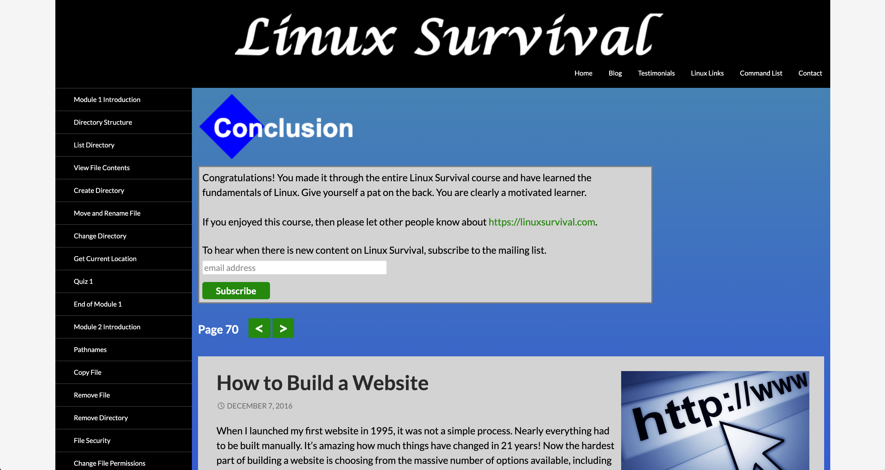

# kottans-backend

<h3>Git Basics</h3>

<p>I've already done it: <a href="https://github.com/jsmuse/kottans-frontend#git-basics">Git and GitHub</a></p>

## Unix Shell

<p>I've got a lot of new information, it's been complicated and interesting. I think I don't afraid command line anymore :)</p>



## Git Collaboration

<p>I've already done it: <a href="https://github.com/jsmuse/kottans-frontend#git-collaboration">Git and GitHub</a></p>

## NodeJS Basics 1

<p>-</p>

## Memory Management

> <p>What's going to happen if program reaches maximum limit of stack ?</p>
<p>If the maximum stack size has been reached, we have a stack overflow and the program receives a Segmentation Fault. While the mapped stack area expands to meet demand, it does not shrink back when the stack gets smaller.</p>

> <p>What's going to happen if program requests a big (more then 128KB) memory allocation on heap ?</p>
<p>The heap is enlarged via the brk() system call (implementation) to make room for the requested block.</p>

> <p>What's the difference between Text and Data memory segments ?</p>
<p>The difference between data and text memory segment is:
-Data segment is contain static variables which can be modified.
-Text segment is read-only and stores all code. </p>

```
08048000-08053000 r-xp 00000000 fc:00 1444599    /bin/cat
08053000-08054000 r--p 0000a000 fc:00 1444599    /bin/cat
08054000-08055000 rw-p 0000b000 fc:00 1444599    /bin/cat
08292000-082b3000 rw-p 00000000 00:00 0          [heap]
b73a6000-b75a6000 r--p 00000000 fc:00 921568     /usr/lib/locale/locale-archive
b75a6000-b75a7000 rw-p 00000000 00:00 0
b75a7000-b774d000 r-xp 00000000 fc:00 2227752    /lib/i386-linux-gnu/libc-2.15.so
b774d000-b774f000 r--p 001a6000 fc:00 2227752    /lib/i386-linux-gnu/libc-2.15.so
b774f000-b7750000 rw-p 001a8000 fc:00 2227752    /lib/i386-linux-gnu/libc-2.15.so
b7750000-b7753000 rw-p 00000000 00:00 0
b7758000-b775a000 rw-p 00000000 00:00 0
b775a000-b775b000 r-xp 00000000 00:00 0          [vdso]
b775b000-b777b000 r-xp 00000000 fc:00 2227760    /lib/i386-linux-gnu/ld-2.15.so
b777b000-b777c000 r--p 0001f000 fc:00 2227760    /lib/i386-linux-gnu/ld-2.15.so
b777c000-b777d000 rw-p 00020000 fc:00 2227760    /lib/i386-linux-gnu/ld-2.15.so
bf9ad000-bf9ce000 rw-p 00000000 00:00 0          [stack]
```


<p>The articals were complicated to understanding. But I figured it out :)

The last task was really difficult for me. The command in description didn’t work for my MAC, so I had to install my virtual machine with linux. And then it worked! I’ve spent a few days to understand where is a mistake. I’m afraid, I still don’t understand why is that command don’t work on my MAC :(</p>


## TCP. UDP. Network

## Http & Https

<h3>Practice</h3>

```
curl https://api.github.com/users/jsmuse
curl -i https://api.github.com/users/jsmuse
curl  https://api.github.com/gists/starred
curl --user "jsmuse:BLABLABLA" https://api.github.com/gists/starred
curl --user "jsmuse:*" https://api.github.com/gists/starred
curl --user "jsmuse" https://api.github.com/gists/starred
```


## Patterns
